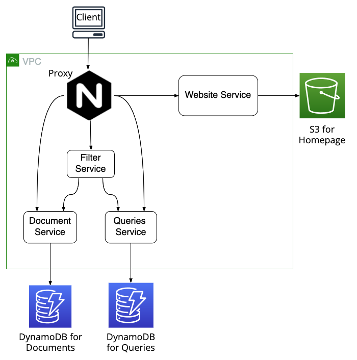

# Document Filter
This is my really simple **Document Filter** web application. The project serves as a practice to familiarize myself with **AWS Cloud**. Here, I experiment with various AWS services and enhance my knowledge of cloud technologies.
The project is deployed on **AWS** and is public accessible via http://ae3bb97ea23de400dac1dcf737ec624f-640437660.eu-north-1.elb.amazonaws.com/website between 7:00 am and 8:00 pm (German time) Monday to Friday. 

## Project Goals
- Utilize and gain hands-on experience with **AWS (S3, EC2, ELB, ECS or EKS, DynamoDB), Docker, CI/CD with GitHub Actions, terraform and helm**

## Used Technologies

- **Frontend:**  
  Developed using **Vite**, a frontend build tool for **Vue**, styled with **Bootstrap**.

- **Backend:**  
  - All backend services are deployed on **Amazon EKS**.  
  - The infrastructure is provisioned using **Terraform**, and deployments are managed via **Helm**.  
  - The EKS cluster is deployed in **public subnets** to avoid the additional cost of **NAT Gateways**. It is exposed to the internet via an **Application Load Balancer (ALB)**, which routes traffic to an **nginx reverse proxy**.
  - Services are distributed across **two Availability Zones** to ensure high availability.

- **Storage:**  
  - **Amazon S3** hosts the website files.  
  - **Amazon DynamoDB** is used to store queries and documents.

- **Deployment:**  
  - via **GitHub Actions**.

## License
This project is licensed under the **MIT License**.