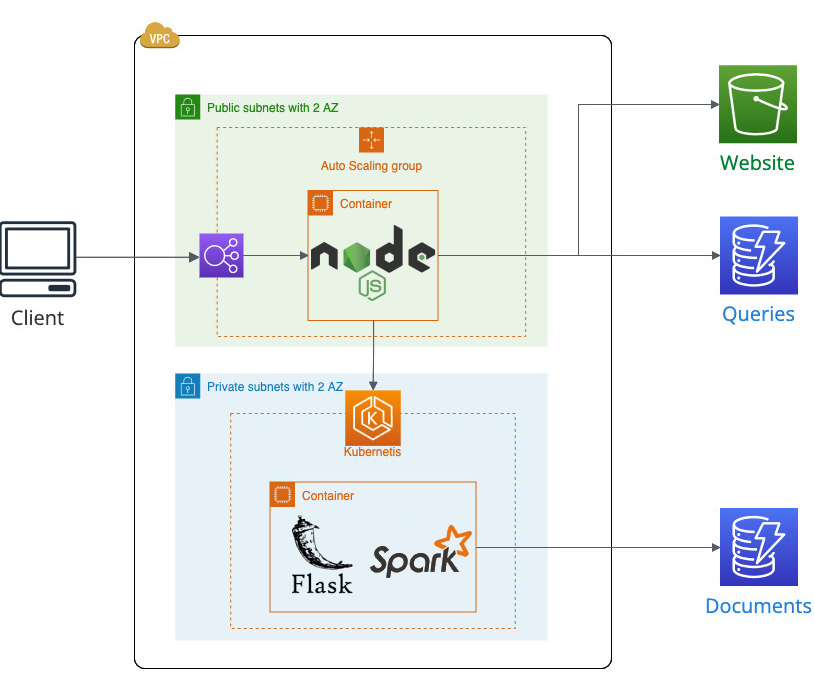

# Document Filter
This is my really simple **Document Filter** web application. The project serves as a practice to familiarize myself with **AWS Cloud**. Here, I experiment with various AWS services and enhance my knowledge of cloud technologies.
The project is deployed on an **AWS** and is public accessible via http://dsf-440288641.eu-north-1.elb.amazonaws.com

## Project Goals
- Utilize and gain hands-on experience with **AWS S3, EC2, ELB, ECS or EKS, DynamoDB, Docker and CI/CD with GitHub Actions**

## Used Technologies

- **Frontend:**  
  Developed using **Vite**, a frontend build tool for **Vue**, styled with **Bootstrap**.

- **Backend:**  
  - The main web server runs in an **Auto Scaling Group** manually created in **public subnets**, using **EC2 instances** behind an **Application Load Balancer (ALB)**.  
  - A second containerized service is deployed on **Amazon EKS** (Elastic Kubernetes Service), using a **node group** within **private subnets**.  
  - Both services are distributed across **two Availability Zones**.

- **Storage:**  
  - **Amazon S3** hosts the website files.  
  - **Amazon DynamoDB** is used to store queries and documents.

- **Deployment:**  
  - via **GitHub Actions**.

## License

This project is licensed under the **MIT License**.